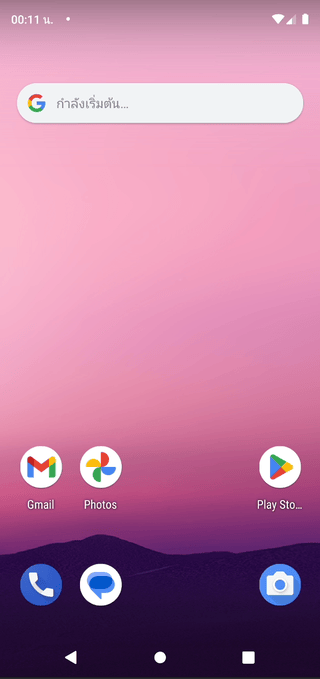

# Photo Picker Challenge
---
If someone tells you that your job as a programmer or Android Dev will be replaced by Generative AI in the future, give them this task to do. This will make your job safe.

## What you have to do
Complete the Android UI Test provided in the `MainActivityTest.kt` file to ensure it functions correctly on both the latest Android version and the older version with the legacy Image Picker.

Feel free to use any Generative AI tool to assist in this task, as that is the primary objective of this test.

> Image file is requires for Android Emulator

## What if I can complete this challenge

* **If you are an Android Developer**: Exactly, that's why Android Developers are still needed.
* **If you are a Software Engineer but not an Android Developer**: This is the advantage of Generative AI, which allows you to understand and work on platforms you've never worked on before.
* **If you can code a bit but don't work in this field**: My career is starting to shake due to the AI era.
* **If you've never coded before, just Generative AI user**: Goodbye to my career.

## License
See [Apache License 2.0](./LICENSE)
